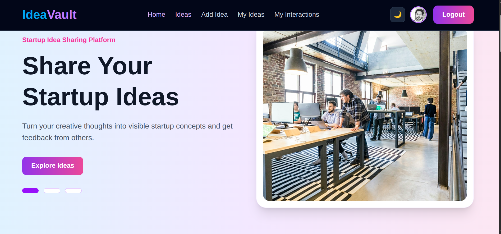
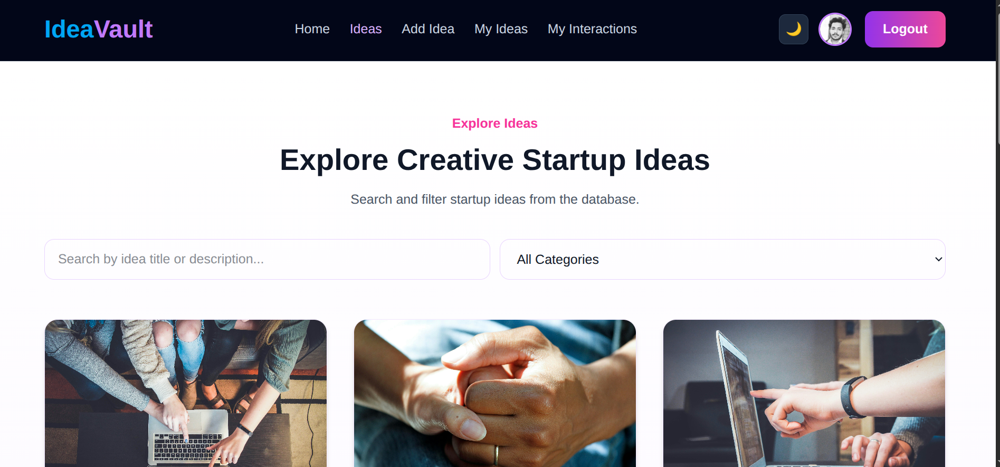
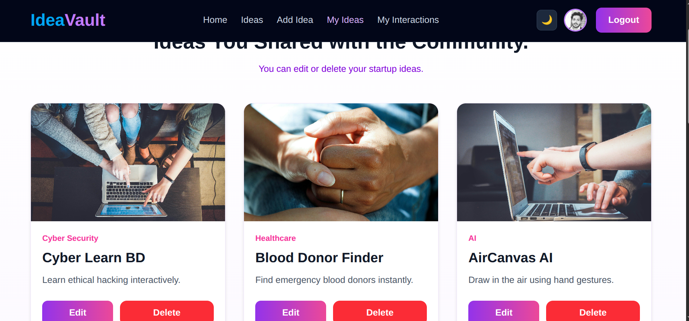

## IdeaVault 

A modern startup idea sharing platform where users can discover, share, and manage innovative ideas. Built with React, Firebase Authentication, Express.js, MongoDB, and Tailwind CSS.

## Live Links

Client:https://ideavault-client-nine.vercel.app/

Server:https://ideavault-server-git-main-eshtiak23s-projects.vercel.app/

## Features

- Firebase Authentication
- Dark & Light Theme Toggle
- Fully Responsive Design
- Add Startup Ideas
- Edit & Delete Ideas
- Trending Ideas Section
- User-Specific Dashboard
- My Interactions Page
- Private Routes with JWT Authentication
- MongoDB Database Integration
- Modern UI with Tailwind CSS
- Toast Notifications
- Premium Gradient Design

#  Technologies Used

##  Frontend

- React
- React Router DOM
- Tailwind CSS
- Firebase
- React Hot Toast
- SweetAlert2

##  Backend

- Node.js
- Express.js
- MongoDB
- JWT (jsonwebtoken)
- Cookie Parser
- CORS
- Dotenv

---

# 🔐 Authentication System

1. Firebase handles user login and registration.
2. JWT token is generated from the backend.
3. Protected routes are secured using token validation.
4. Cookies are used for authentication persistence.

## Core Pages
- Home
- Ideas
- Idea Details
- Add Idea
- Edit Idea
- My Ideas
- My Interactions
- Login
- Register
- Profile

📸 Screenshot

👨‍💻 Developer

- MD Eshtiak Ahmed
React & MERN Stack Developer,
Passionate about UI/UX & Cyber Security.

## License

This project is created for educational and learning purposes.